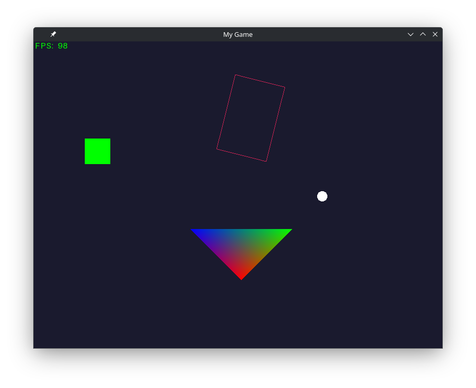

# [pyrendering](https://pypi.org/project/pyrendering)

Python game building/rendering framework



---

## Instalation

The framework is published on [PyPI](https://pypi.org/project/pyrendering) under the name `pyrendering`.

```bash
pip install pyrendering
```

## Examples

Examples can be found in the [examples directory](./pyrendering/src/examples) and cover most of the framework's features.

## Video demo


## License

This project is licensed under the [GNU GPLv3](./LICENSE).
